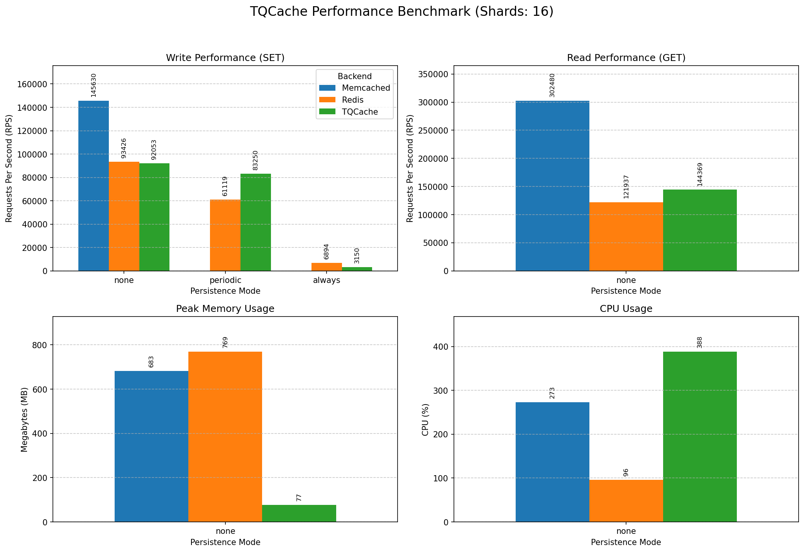

# TQCache

TQCache is a high-performance, persistent session storage server. It provides a Memcached-compatible interface
with disk-based persistence, making it ideal for session storage that survives restarts.

## Features

- **Session Storage**: Ideal for PHP's native `memcached` session handler
- **Persistent Storage**: Data stored on disk, survives server restarts
- **Efficient Storage**: About 25-33% waste space on disk on average
- **Faster than Redis**: About 2x faster than Redis in typical cases
- **Memcached Compatible**: Supports all Memcached commands, including binary protocol
- **Generous Limits**: Maximum key size is 1KB / Maximum value size is 64MB
- **Eviction Optional**: Set `max-data-size = 0` to disable eviction (default)
- **TTL Enforcement**: Maximum TTL defaults to 24 hours (set to 0 to disable)

## Requirements

- Go 1.21 or later

## Installation

```bash
go install github.com/mevdschee/tqcache/cmd/tqcache@latest
```

Or build from source:

```bash
git clone https://github.com/mevdschee/tqcache.git
cd tqcache
go build -o tqcache ./cmd/tqcache
```

## Usage

```bash
tqcache [options]
```

### Command-Line Flags

| Flag             | Default     | Description                                                    |
|------------------|-------------|----------------------------------------------------------------|
| `-config`        |             | Path to INI config file (overrides other flags)                |
| `-listen`        | `:11211`    | Address to listen on (`[host]:port`)                           |
| `-data-dir`      | `data`      | Directory for persistent data files                            |
| `-shards`        | `16`        | Number of shards for parallel access                           |
| `-default-ttl`   | `0`         | Default TTL for keys (`0` = no expiry)                         |
| `-max-ttl`       | `24h`       | Maximum TTL cap for any key (`0` = unlimited)                  |
| `-max-data-size` | `64MB`      | Max live data size in bytes for LRU eviction (`0` = unlimited) |
| `-sync-mode`     | `periodic`  | Sync mode: `none`, `periodic`, `always`                        |
| `-sync-interval` | `1s`        | Interval between fsync calls (when periodic)                   |

**Fixed limits:** Max key size is 1KB, max value size is 64MB.

NB: You may also use a config file instead of CLI flags (see [tqcache.conf](cmd/tqcache/tqcache.conf)).

## PHP Configuration

Configure PHP to use TQCache as the session handler:

```ini
session.save_handler = memcached
session.save_path = "localhost:11211"
```

NB: Set "max-data-size = 0" and "max-ttl = 24h" to prevent data loss and prevent disk space exhaustion.

## Performance

**TQCache vs Redis vs Memcached**

Benchmarks were run on a local development environment (Linux, Loopback).
100,000 keys were used for the benchmark, each with a size of 10KB.

### Benchmark Results



### Performance Highlights
- **Write (SET)**: outperforms Redis (~83k RPS vs ~61k RPS) in writing persistence-backed data (Periodic Sync).
- **Read (GET)**: outperforms Redis (~144k RPS vs ~122k RPS) in reading from memory.
- **Memory Efficiency**: uses ~10x less memory than Redis (~77MB vs ~769MB), uses OS disk cache.
- **CPU Efficiency**: uses ~4x more CPU than Redis (~4 vs ~1 core) as Redis is single threaded.

### Summary Table

| Reference | SET (RPS) | GET (RPS) | Memory (MB) | CPU Usage |
| :--- | :--- | :--- | :--- | :--- |
| **Memcached** (Memory) | ~146k | ~302k | ~683MB | ~3 core |
| **Redis** (Periodic) | ~61k | ~122k | ~769MB | ~1 core |
| **TQCache** (Periodic) | ~83k | ~144k | ~77MB | ~4 core |

NB: the amount of cores used can be calculated as: shards / 4

## Testing

```bash
go test ./pkg/tqcache/...
```

## Architecture

TQCache stores session data on disk in a fixed-size record formats and
holds several memory data structures to speed up access. It assumes SSD
performance with good random I/O and enough free memory to let the OS keep
the disk blocks in the cache. It does not perform any disk I/O optimization
and does not use append-only files. 

See [PROJECT_BRIEF.md](PROJECT_BRIEF.md) for detailed architecture.
